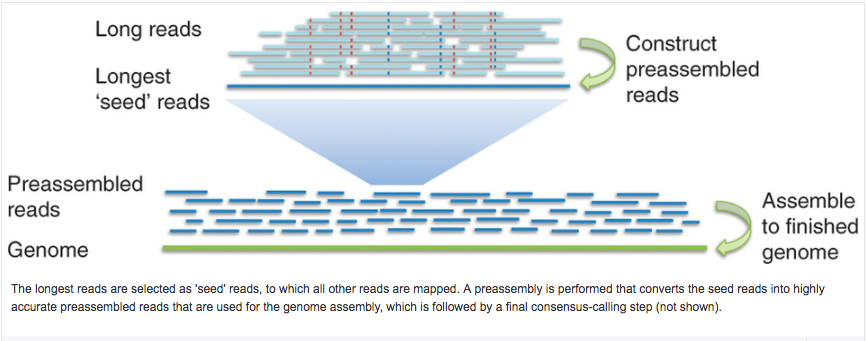

#Assembly with PacBio data and SMRT Portal

<!-- *FIXME to do*

- where is some pac bio data - should be on its way soon - email from mabel.
- to get into SMRT portal: need to download onto particular GVL
- is format ok or do we need certain files- and how many cells per sample ?

-->

This tutorial will show you how to assemble a bacterial genome de novo, using the PacBio SMRT Portal on the mGVL.

## Start
- Open your mGVL dashboard.
- Go to Admin. There is a list of packages. Find SMRT Analysis. On the right, click on <ss>Install</ss>.
- You should see SMRT Portal as one of the instance services on your GVL dashboard.
- Open up the SMRT portal web link (to the right) and register/log on.

## Overview

In this tutorial, we will run three pipelines to assemble a bacterial genome.

1. Assembly with HGAP
2. Corrections with RS_Resequencing
3. Examination with RS_Bridgemapper

<!--
Not included here?
- trim overhang
- circularise
- annotate
-->

## Input

- Put PacBio data onto your GVL.
    - How to
- Or, use sample training data for this tutorial
    - Load onto your GVL; or use GVL with it already loaded.

- In the SMRT Portal, go to <ss>Design Job</ss>, the top left tab.
- Go to <ss>Import and Manage: Import SMRT cells: SMRT Cells</ss>. Work out where you put the data on your GVL, and make sure the file path is showing. If not, click <ss>Add</ss> and list the file path to the data.
- Click on the file path and then <ss>Scan</ss> to check for new data.

## Assemble with HGAP

- Go back to the top tab <ss>Design Job</ss>.
- Go to <ss>Create New</ss>.
- An <ss>Analysis</ss> window should appear. Check the box next to <ss>De novo assembly</ss>, then <ss>Next</ss>.
- Under <ss>Job Name</ss> enter a name.
- Under <ss>Protocols</ss> choose <ss>RS_HGAP_Assembly.3</ss>.

- There is an ellipsis underneath <ss>Protocols</ss> - click on the ellipsis.

This brings up the settings.

- This protocol is a collection of other protocols for filtering, assembly, mapping and consensus. (These are the .xml files).

- Settings to change:

- Assembly:
    - Pre-assembly:
        - For <ss>Compute Minimum Seed Read Length</ss>: ensure box is ticked
        - For <ss>Number of Seed Read Chunks</ss>: enter *12*

      - Assembly:
          - Change the <ss>Genome Size</ss> to an approximately correct size for the species.
          - For <ss>Target Coverage</ss>: enter *10*
          - For <ss>Overlapper Error Rate</ss>: enter *0.04*
          - Click <ss>Ok</ss>.  
<!--

Figure 1 from Chin et al, 2013, *Nature Methods*.
-->

- In the <ss>SMRT Cells Available</ss> window, select the file to be used. Click on the arrow to transfer these files to the SMRT Cells in Job window.

- Click <ss>Save</ss>.
- Next to <ss>Save</ss>, click <ss>Start</ss>.
- The <ss>Monitor Jobs</ss> window should open.
    - As each step proceeds, new items will appear under the <ss>Reports</ss> and <ss>Data</ss> tabs on the left.

###Output
- The finished jobs will be under the <ss>View Data</ss> tab.
- Filtering:
    - see stats: e.g. the polymerase read length post-filter (is now much longer)
    - see graph: polymerase read quality: see how read quality was filtered for 0.8 (the default)
- Assembly: Preassembly:
    - length cutoff: was calculated. see what it was. shorter reads were mapped to reads of this length or longer. => preassembled reads (I think?)
- Assembly: Assembly:
    - stats: how many contigs. if 1, done.
    - if many, will try some corrections

##Correct with RS_Resequencing
= BLASR + Quiver

- Download FASTA polished assembly from step above
- Go to Design Job, Import and Manage, button at the base of the page: New, then select that FASTA assembly file to upload.
    - creates a new reference.

##Examine with RS_Bridgemapper
= BLASR + Quiver + Bridgemapper  
=> view using SMRTview

## Next
Correct with Illumina reads <link to tutorial>

## Links to more information
- [HGAP overview](https://github.com/PacificBiosciences/Bioinformatics-Training/wiki/HGAP)
- [A full ist of reports and terminology is here](http://files.pacb.com/software/smrtanalysis/2.3.0/doc/smrtportal/help/Webhelp/SMRT_Portal.htm)
