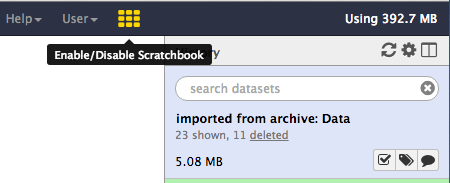

# Variant calling with Snippy

## Background

Variant calling is the process of identifying differences between to genome samples.
Usually differences are limited to single nucleotide polymorphisms (SNPs) and small insertions and deletions (indels). Larger structural variation such as inversions, duplications and large deletions are not typically covered by "variant calling".

## Learning Objectives

At the end of this tutorial you should be able to:

1. Find variants between a reference genome and a set of reads
2. Determine the effect of those variants on genomic features
3. Understand if the SNP is potentially affecting the phenotype

<!---
## Experiment

FIXME: You are working on a bug and you notice one of them is forming smaller colonies than normal. You want to find out why this small colony variant (SCV) is doing at the DNA level.
--->

## Prepare reference

We will use the same data that we used in the [Assembly with Spades tutorial.](../spades/index.md) This should still be in your current galaxy history. If not, re-import the data into a new history using the instructions in that tutorial.

For variant calling, we need a reference genome that is of the same strain as the input sequence reads.

For this tutorial, our reference is the <fn>wildtype.gbk</fn> file and our reads are <fn>mutant_R1.fastq</fn> and <fn>mutant_R2.fastq</fn>.

<!--
!!! note
    Please make sure your reference genome includes all chromosomes and plasmids
-->

## Call variants with Snippy

- Go to <ss>Tools &rarr; NGS Analysis &rarr; NGS: Variant Analysis &rarr; snippy</ss>
- For <ss>Reference type</ss> select *Genbank*.
- Then for <ss>Reference Genbank</ss> choose the <fn>wildtype.gbk</fn> file.
- For <ss>Single or Paired-end reads</ss> choose *Paired*.
- Then choose the first set of reads, <fn>mutant_R1.fastq</fn> and second set of reads, <fn>mutant_R2.fastq</fn>.
- For <ss>Cleanup the non-snp output files</ss> select *No*.

Your tool interface should look like this:

- Click <ss>Execute</ss>.

## Examine snippy output

First, enable "Scratchbook" in Galaxy - this allows you to view several windows simultaneously. Click on the squares:

From snippy, there are 10 output files in various formats.

- Go to the file called <fn>snippy on data XX, data XX and data XX table</fn> and click on the eye icon.
- We can see a list of variants. Look in column 3 to see which types the variants are, such as a SNP or a deletion.
- Look at the third variant called. This is a T&rarr;A mutation, causing a stop codon. Look at column 14: the product of this gene is a methicillin resistance protein. Methicillin is an antibiotic. What might be the result of such a mutation? [add a hint/info box]

## View snippy output in JBrowse

- Go to <ss>Statistics and Visualisation &rarr; Graph/Display Data &rarr; JBrowse</ss>

- Under <ss>Fasta Sequence(s)</ss> choose <fn>wildtype.fna</fn>. This sequence will be the reference against which annotations are displayed.

- For <ss>Produce a Standalone Instance</ss> select *Yes*.

- For <ss>Genetic Code</ss> choose *11: The Bacterial, Archaeal and Plant Plastid Code*.

- We will now set up three different tracks - these are datasets displayed underneath the reference sequence (which is displayed as nucleotides in FASTA format). We will choose to display the sequence reads (the .bam file), the variants found by snippy (the .gff file) and the annotated reference genome (the wildtype.gff)

*Track 1 - sequence reads*

- Click <ss>Insert Track Group</ss>
- name it "sequence reads"
- Click <ss>Insert Annotation Track</ss>
- For <ss>Track Type</ss> choose *BAM Pileups*
- For <ss>BAM Track Data</ss> select <fn>the snippy bam file</fn>
- For <ss>Autogenerate SNP Track</ss> select *Yes*

*Track 2 - variants*

- Click <ss>Insert Track Group</ss> again
- name it "variants"
- Click <ss>Insert Annotation Track</ss>
- For <ss>Track Type</ss> choose *GFF/GFF3/BED/GBK Features*
- For <ss>SNP Track Data</ss> select <fn>the snippy snps gff file</fn>

*Track 3 - annotated reference*

- Click <ss>Insert Track Group</ss> again
- name it "annotated reference"
- Click <ss>Insert Annotation Track</ss>
- For <ss>Track Type</ss> choose *GFF/GFF3/BED/GBK Features*
- For <ss>SNP Track Data</ss> select <fn>wildtype.gff</fn>
- Under <ss>JBrowse Styling Options &rarr; JBrowse style. description</ss> type in *product,note,description*

- Click <ss>Execute</ss>

- A new file will be created, called <fn>JBrowse on data XX and data XX - Complete</fn>. Click on the eye icon next to the file name. The JBrowse window will appear in the centre Galaxy panel.

- On the left, tick boxes display the tracks

- Use the minus button to zoom out to see:
    - sequence reads and their coverage (the grey graph)

- Use the plus button to zoom in to see:
    - probable real variants (a whole column of snps)
    - probable errors (single one here and there)

- In the coordinates box, type in *47299*, the position of the SNP discussed above.
    - the ref seq codes for cysteine at this position (the middle row of the top aa translation)
    - the mutation - makes this triplet into a stop codon

<!---
FIXME: talk about multimapping reads?

## Filter variants
FIXME:  vcffilter? something else?  mindepth, homozygous?

## Annotate consequencs

-- how to get ref genome in?

FIXME: snpEff - but it is hard to add a genome

!!! hint
    Just use Snippy and all this will happen magically?
--->

<!--
* SNPs can be used to build [phylogentic trees](/trees/index.md).
-->
