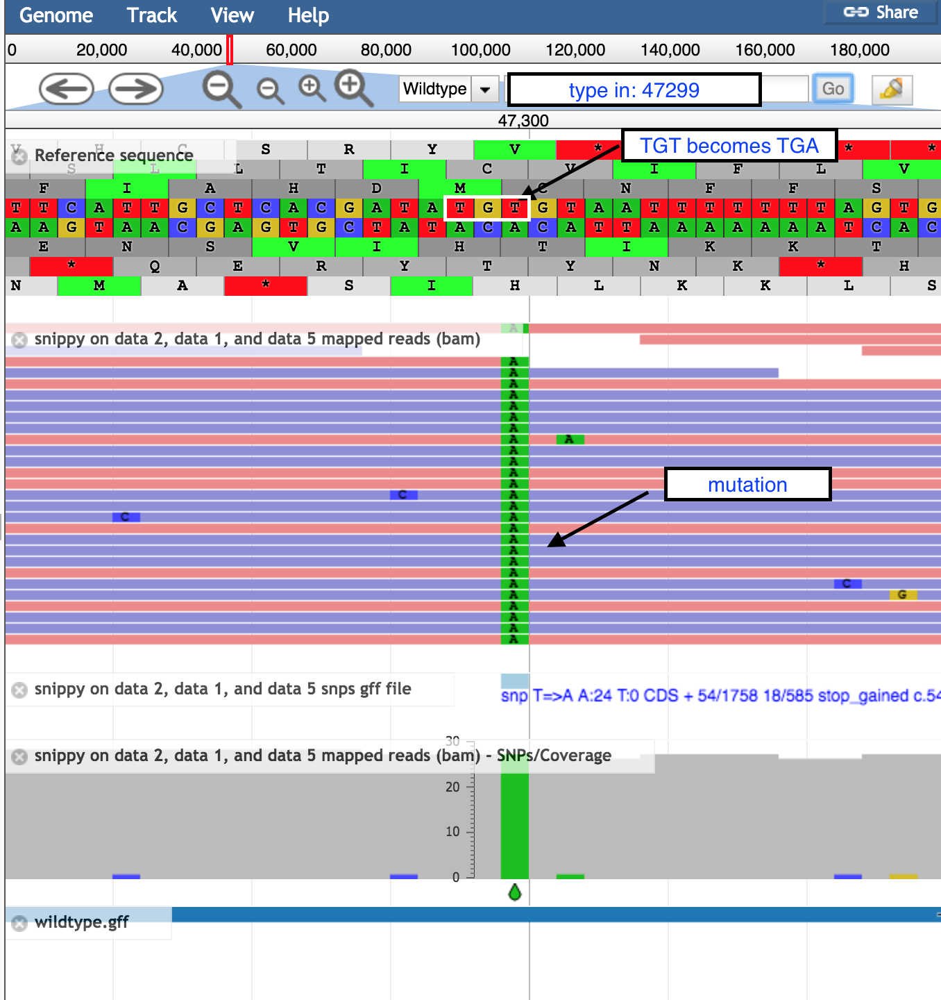

# Basic Variant Finding

## Background

Variant calling is the process of identifying differences between two genome samples.
Usually differences are limited to single nucleotide polymorphisms (SNPs) and small insertions and deletions (indels). Larger structural variation such as inversions, duplications and large deletions are not typically covered by "variant calling".

## Learning Objectives

1. How to map sequence reads versus a reference
2. Visualise the resultant BAM file of alignments
3. Search the BAM file for variants using a SNP caller
4. Filter the SNPS

## Prepare reference

<!-- We will import  history from Galaxy:

- In the menu options across the top, go to <ss>Shared Data</ss>.
- Click on <ss>Histories</ss>.
- A list of published histories should appear. Click on <fn>GCC 2016 small genome variants</fn>.
- Click on <ss>Import history</ss>.
- An option will appear to re-name the history. We don't need to rename it, so click <ss>Import</ss>.
- The history will now appear in your Current History pane, and the files are now ready to use in Galaxy analyses.
-->

<!-- We will use the same data that we used in the [Assembly with Spades tutorial.](../spades/index.md) This should still be in your current galaxy history. If not, re-import the data into a new history using the instructions in that tutorial.-->

For variant calling, we need a reference genome that is of the same strain as the input sequence reads.

For this tutorial, our reference is the <fn>wildtype.fna</fn> file and our reads are <fn>mutant_R1.fastq</fn> and <fn>mutant_R2.fastq</fn>.

If these files are not presently in your Galaxy history, import them from the [Training dataset page.](../data-dna/index.md)

## Map reads with BWA mem

- Go to <ss>Tools &rarr; NGS Analysis &rarr; NGS: Mapping &rarr; Map with BWA mem</ss>
- For <ss>Will you select a reference genome from your history or use a built-in index?</ss> select *Use a genome from history...*.
- Then for <ss>Reference Sequence</ss> choose the <fn>wildtype.fna</fn> file.
- For <ss>Single or Paired-end reads</ss> choose *Paired*.
- Then choose the first set of reads, <fn>mutant_R1.fastq</fn> and second set of reads, <fn>mutant_R2.fastq</fn>.
- Leave everything else as default.

- Click <ss>Execute</ss>.

## Convert the BAM File to a SAM file.

Now we want to look at the results. BWA mem will produce a BAM file. This is a compressed non-human readable format. So to see what it looks like, we need to convert the BAM file to a SAM file.

- Go to <ss>Tools &rarr; NGS: Sam tools &rarr; BAM-to-SAM</ss>
- Select the BAM file we just produced above and click <ss>Execute</ss>

Now look at the contents of the resultant SAM file.

## View BAM file in JBrowse

- Go to <ss>Statistics and Visualisation &rarr; Graph/Display Data &rarr; JBrowse</ss>

- Under <ss>Fasta Sequence(s)</ss> choose <fn>wildtype.fna</fn>. This sequence will be the reference against which BAM file is displayed.

- For <ss>Produce a Standalone Instance</ss> select *Yes*.

- For <ss>Genetic Code</ss> choose *11: The Bacterial, Archaeal and Plant Plastid Code*.

- We will now set up a new track We will choose to display the sequence reads (the .bam file)

*Track 1 - sequence reads*

- Click <ss>Insert Track Group</ss>
- For <ss>Track Cateogry</ss> name it "sequence reads"
- Click <ss>Insert Annotation Track</ss>
- For <ss>Track Type</ss> choose *BAM Pileups*
- For <ss>BAM Track Data</ss> select <fn>the bam file</fn>
- For <ss>Autogenerate SNP Track</ss> select *Yes*

- Click <ss>Execute</ss>

- A new file will be created, called <fn>JBrowse on data XX and data XX - Complete</fn>. Click on the eye icon next to the file name. The JBrowse window will appear in the centre Galaxy panel.

- On the left, tick the boxes to display the tracks

- Use the minus button to zoom out to see:
    - sequence reads and their coverage (the grey graph)

- Use the plus button to zoom in to see:
    - probable real variants (a whole column of snps)
    - probable errors (single one here and there)

- In the coordinates box, type in *47299* and then <ss>Go</ss> to see the position of the SNP discussed above.
    - the correct codon at this position is TGT, coding for the amino acid Cysteine, in the middle row of the amino acid translations.
    - the mutation of T &rarr; A turns this triplet into TGA, a stop codon.

    

#### End of part 1 of this exercise!
