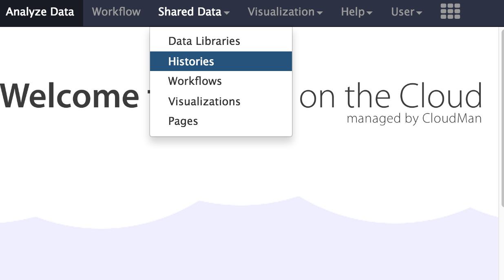
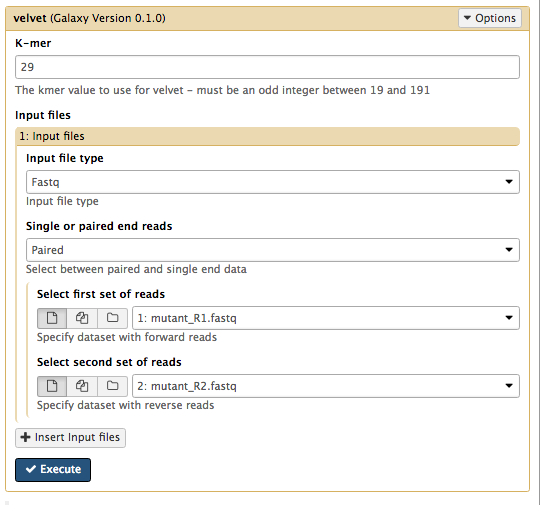
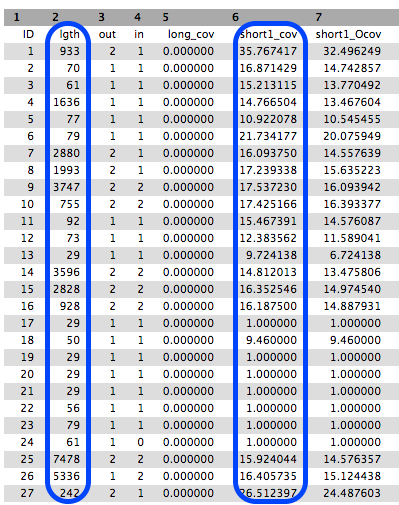
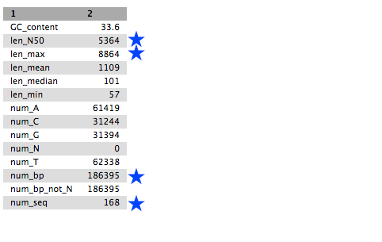

#Assembly using Velvet

## Background
Velvet is one of a number of *de novo* assemblers that use short read sets as input (e.g. Illumina Reads), and the assembly method is based on de Bruijn graphs. For information about Velvet see this [link](https://en.wikipedia.org/wiki/Velvet_assembler).

<!---
A protocol for assembling with Velvet (another *de novo* assembler) is available [here](https://docs.google.com/document/d/1xs-TI5MejQARqo0pcocGlymsXldwJbJII890gnmjI0o/pub).
--->

In this activity, we will perform a *de novo* assembly of a short read set using the Velvet assembler.

## Learning objectives
At the end of this tutorial you should be able to:

1. assemble the reads using VelvetOptimiser, and
2. examine the output assembly.

## Galaxy Background

Galaxy is a web-based analysis and workflow platform designed for biologists to analyse their own data. It can be used to run a variety of bioinformatics tools. The selection of bioinformatics tools installed on the Galaxy instance we are using today caters for the analysis of bacterial genomics data sets.

Galaxy is an open, web-based platform. Details about the project can be found [here](https://galaxyproject.org/).

The Galaxy interface is separated into three parts. The <ss>Tools</ss> list on the left, the <ss>Viewing</ss> panel in the middle and the analysis and data <ss>History</ss> on the right.

## Register in Galaxy

Open a new tab or window on your web browser. Use Firefox or Chrome - please don’t use Internet Explorer or Safari.

In the address bar, type in the address of your galaxy server, e.g. [Galaxy-Mel](https://galaxy-mel.genome.edu.au/galaxy/).

Click on <ss>User</ss> button on the right.

If you have never registered on this Galaxy server before:

- Select: <ss>User &rarr; Register</ss>
- Enter your email, choose a password, and choose a user name.
- Click <ss>Submit</ss>

If you have, just login:

- Select: <ss>User &rarr; Login</ss>
- Enter your email and password.
- Click <ss>Submit</ss>

Return to the home screen.

## Import a history

- In the menu options across the top, go to <ss>Shared Data</ss>.
- Click on <ss>Published Histories</ss>.

- A list of published histories should appear. Click on the history called **Microbial-genomics-workshop**
- Click on <ss>Import history</ss>.
- An option will appear to re-name the history. We don't need to rename it, so click <ss>Import</ss>.

- The history will now appear in your Current History pane, and the files are ready to use in Galaxy analyses.

- The read set for today is from an imaginary *Staphylococcus aureus* bacterium with a miniature genome.
- The whole genome shotgun method used to sequence our mutant strain read set was produced on an Illumina DNA sequencing instrument.

- The files we need for assembly are the <fn>mutant_R1.fastq</fn> and <fn>mutant_R2.fastq</fn>.
- The reads are paired-end.
- Each read is 150 bases long. <!--(before trimming)-->

-   The number of bases sequenced is equivalent to 19x the genome sequence of the wildtype strain. (Read coverage 19x - rather low!).

<!--
- <fn>wildtype.fna</fn>: the reference genome sequence of the wildtype strain in fasta format (a header line, then the nucleotide sequence of the genome)

- <fn>wildtype.gff</fn>: the reference genome sequence of the wildtype strain in general feature format (a list of features - one feature per line, then the nucleotide sequence of the genome).

- <fn>wildtype.gbk</fn>: the reference genome sequence in genbank format.
--->

- Click on the View Data button (the ) next to one of the FASTQ sequence files.

<!--
- The gff file should look like this:
- Brief Discussion about the GFF format (FIXME: add)

## Evaluate the input reads

Questions you might ask about your input reads include:

- How good is my read set?
- Do I need to ask for a new sequencing run?  
- Is it suitable for the analysis I need to do?

We will evaluate the input reads using the FastQC tool.

- This runs a standard series of tests on your read set and returns a relatively easy-to-interpret report.
- We will use the FastQC tool in Galaxy to evaluate the quality of one of our FASTQ files.
- Go to <ss>Tools &rarr; NGS:Analysis &rarr; NGS: QC and Manipulation &rarr; FastQC</ss>
- Select <fn>mutant_R1.fastq</fn>
- <ss>Execute</ss>
- Once finished, examine the output called <fn>FastQC on data1:webpage</fn> (Hint:). It has a summary at the top of
the page and a number of graphs.

Some of the important outputs of FastQC for our purposes are:

-   <ss>Basic Statistics: Sequence length</ss>: will be important in setting maximum k-mer size value for assembly
-   <ss>Basic Statistics: Encoding</ss>: Quality encoding type: important for quality trimming software
-   <ss>Basic Statistics: % GC</ss>: high GC organisms don’t tend to assemble well and may have an uneven read coverage distribution.
-   <ss>Basic Statistics: Total sequences</ss>: Total number of reads: gives you an idea of coverage.
-   <ss>Per base sequence quality</ss>: Dips in quality near the beginning, middle or end of the reads: determines possible trimming/cleanup methods and parameters and may indicate technical problems with the sequencing process/machine run.
-   <ss>Per base N content</ss>: Presence of large numbers of Ns in reads: may point to poor quality sequencing run. You would need to trim these reads to remove Ns.
-   <ss>Kmer content</ss>: Presence of highly recurring k-mers: may point to contamination of reads with barcodes or adapter sequences.

Although we have warnings for two outputs (per base sequence content; Kmer content), we can ignore these for now. For a fuller discussion of FastQC outputs and warnings, see the [FastQC website link](http://www.bioinformatics.babraham.ac.uk/projects/fastqc/), including the section on each of the output [reports](http://www.bioinformatics.babraham.ac.uk/projects/fastqc/Help/3%20Analysis%20Modules/), and examples of ["good"](http://www.bioinformatics.babraham.ac.uk/projects/fastqc/good_sequence_short_fastqc.html) and ["bad"](http://www.bioinformatics.babraham.ac.uk/projects/fastqc/bad_sequence_fastqc.html) Illumina data. We won’t be doing anything to these data to clean it up as there isn’t much need. Therefore we will get on with the assembly!

-->

## Assemble reads with Velvet

Everyone will be choose/be assigned a value of k (k-mer length) to use in their assembly with Velvet. We will then populate a spreadsheet with result metrics from all of the different assemblies. The spreadsheet can be found [here in the shared kmer spreadsheet](https://docs.google.com/spreadsheets/d/1Ruik9-An8aPSVGIr5v29xyoGWpmq-I5iuRHfa-MPV6c/edit?usp=sharing). Please put your name in a blank space in the **Name** column of the spreadsheet and note the value for k next to it.

- We will perform a *de novo* assembly of the mutant FASTQ reads into long contiguous sequences (in FASTA format.)
- Velvet requires the user to input a value of *k* for the assembly process. K-mers are fragments of sequence reads. Small k-mers will give greater connectivity, but large k-mers will give better specificity.

<!---
- velvet produces both contigs and scaffolds.
Ask your demonstrator if you would like to know the difference between contigs and scaffolds.
--->

- Go to <ss>Tools &rarr; NGS Analysis &rarr; NGS: Assembly &rarr; velvet</ss>
- Set the following parameters (leave other settings as they are):

    - <ss>K-mer</ss>: Enter the value for k that you have been assigned in the spreadsheet.
    - <ss>Input file type</ss>: Fastq
    - <ss>Single or paired end reads</ss>: Paired
    - <ss> Select first set of reads</ss>: <fn>mutant_R1.fastq</fn>  
    - <ss> Select second set of reads</ss>: <fn>mutant_R2.fastq</fn>

- Your tool interface should look something like this (you will most likely have a different value for k):

-  Click <ss>Execute</ss>

## Examine the output

- Galaxy is now running velvet on the reads for you.
- Press the refresh button in the history pane to see if it has finished.
- When it is finished, you will have three new files in your history.  

    - a <fn>Contigs</fn> file
    - a <fn>Contigs stats</fn> file
    - the velvet <fn>log</fn> file

- Click on the View Data button  on each of the files.

- The <fn>Contigs</fn> file will show each contig with the *k-mer length* and *k-mer coverage* listed as part of the header (however, these are just called *length* and *coverage*).
    - *K-mer length*: For the value of k chosen in the assembly, a measure of how many k-mers overlap (by 1 bp each overlap) to give this length.
    - *K-mer coverage*: For the value of k chosen in the assembly, a measure of how many k-mers overlap each base position (in the assembly).

- The <fn>Contigs stats</fn> file will show a list of these k-mer lengths and k-mer coverages.

- We will summarise the information in the <fn>log</fn> file.

## Collect some statistics on the contigs.

- Go to <ss>Basic Tools &rarr; NGS Common Toolsets &rarr; FASTA manipulation &rarr; Fasta statistics</ss>
- For the required input file, choose the velvet <fn>Contigs</fn> file.
- Click <ss>Execute</ss>.
- A new file will appear called <fn>Fasta summary stats</fn>
- Click the eye icon to look at this file. (It will look something like - but not exactly like - this.)

- Look at:
    - *num_seq*: the number of contigs in the FASTA file.
    - *num_bp*: the number of assembled bases. Roughly proportional to genome size.
    - *len_max*: the biggest contig.  
    - *len_N50*: N50 is a contig size. If contigs were ordered from small to large, half of all the nucleotides will be in contigs this size or larger.

**Now copy the relevant data back into the k-mer spreadsheet on your line.**

Along with the demonstrator, have a look at the effect of the k-mer size on the output metrics of the assembly. Note that there are local maxima and minima in the charts. What do you think is happening here? Why is the value of k (the k-mer size) having an effect? <!--In next week's lecture, this will be discussed in detail. -->

## Assembly with Velvet Optimiser

Now that we have seen the effect of k-mer size on the assembly, we will run the Velvet Optimiser to automatically choose the best k-mer size for us. It will use the "n50" to determine the best k-mer value to use. It then performs the further graph cleaning steps and automatically chooses a bunch of other parameters for velvet. We should get a much better assembly result than we did with our attempts with Velvet alone..

- Go to <ss>Tools &rarr; NGS Analysis &rarr; NGS: Assembly &rarr; Velvet Optimiser</ss>
- Set the following parameters (leave other settings as they are):

    - <ss>Start k-mer size</ss>: 45
    - <ss>End k-mer size</ss>: 73
    - <ss>Input file type</ss>: Fastq
    - <ss>Single or paired end reads</ss>: Paired
    - <ss> Select first set of reads</ss>: <fn>mutant_R1.fastq</fn>  
    - <ss> Select second set of reads</ss>: <fn>mutant_R2.fastq</fn>

    -  Click <ss>Execute</ss>
    
## Look at the fasta statistics for the Velvet Optimiser contigs

Use the Fasta Statistics tool you used earlier to summarise the Velvet Optimiser output. Examine the resulting table. What are the main differences?

Have a look at the Velvet Optimiser log file, it's hidden. Click on the **hidden** link at the top of the History pane. You'll then need to examine it's STDERR output by clicking on the **name of the file**, then the **"i"** icon, then **stderr**.

Can you find which **k** value VelvetOptimiser used for it's final assembly? You should also notice that it set another couple of parameters, the expected coverage and the coverage cutoff.. Any ideas what these are? See the [Velvet paper](http://www.genome.org/cgi/content/short/18/5/821) or the [Velvet manual](https://www.ebi.ac.uk/~zerbino/velvet/Manual.pdf) for details on these parameters. 

<!-- ## What next?

- [Annotate the genome using Prokka.](/modules/prokka/index.md)
-->
