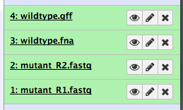
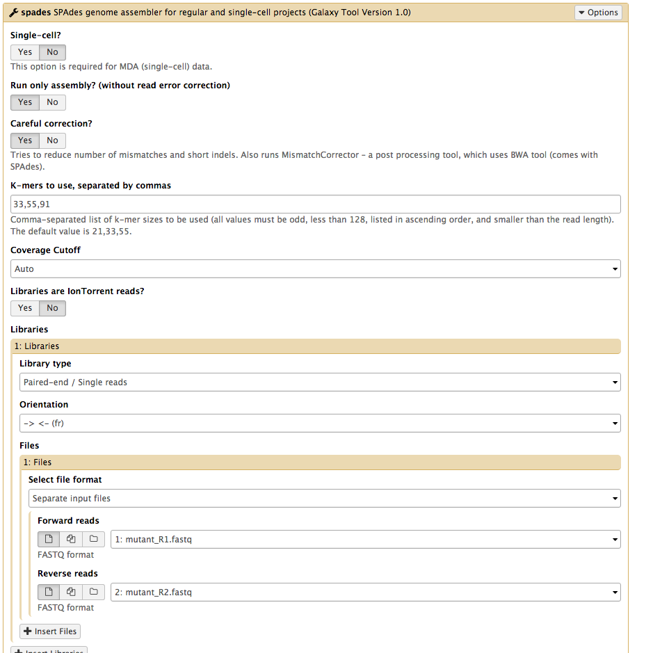

# Assembly using Spades

## Background
Spades is one of a number of *de novo* assemblers that use short read
sets (Illumina Reads) as an input and the method for assembly is based
on de Bruijn graphs. For information about Spades see this
[link](http://bioinf.spbau.ru/spades). A protocol for assembling with
Velvet (another *de novo* assembler) is available
[here](https://docs.google.com/document/d/1xs-TI5MejQARqo0pcocGlymsXldwJbJII890gnmjI0o/pub).

In this activity, we will perform a *de novo* assembly of a short read
set (from an Illumina sequencer) using the SPAdes assembler. The output
from SPAdes that we are interested in is a multifasta files that
contains the draft genome sequence.

The read set for today is from an imaginary *Staphylococcus aureus*
bacterium with a miniature genome.

We have a closed, annotated genome sequence for a closely related
*wildtype* strain.

The whole genome shotgun method used to sequence our mutant strain The
read set was produced on an Illumina DNA sequencing instrument.

-   The reads are paired-end
-   Each read is 150 bases (before trimming)
-   The number of bases sequenced is equivalent to 19x the genome
    sequence of the wildtype strain. (Read coverage 19x - rather low!)

## Log in to Galaxy
1. **Go to the Galaxy Page** Web address: <http://43.240.98.1/galaxy>  
2. [Remind me how to logon](https://docs.google.com/document/d/1LAQvhIG8s-vv6T14bb8lGRkmoNha7E3bHf9kAgUwMs0/pub)

## Import data into Galaxy
1. Click on the **Analyze Data** menu at the top of the page.    
2. Click on the History menu button (the on the top right of the history pane)
3. Click **Import from File** (at the bottom of the list)  
4. A new page will appear with a text box for the URL of the history to import.  
5. Copy the following URL into the text box: <http://43.240.98.1/public/dieter/Galaxy-History-Colombiaworkshopstart.tar.gz>  
6. Click **Submit**  
7. Galaxy will download the data files from the internet and will be available as an additional history (takes about one minute).  
8. **To make the newly imported history appear as the current history**  
  a. Click on the View all Histories button  (the on the top right of the history pane).  
  b. If the history has finished downloading it will appear as **imported from archive: Colombia_workshop_start**
9. Click on the  button above the **imported from archive:Colombia_workshop_start** then the button.
10. You should now have 4 files in the history pane as follows:

## View imported files
All the files are are text files.
- mutant_R1.fastq and mutant_R2.fastq : a paired-end read set
- Wildtype.fna : a file that contains the genome sequence of
the wildtype strain in fasta format (a header line, then the nucleotide
sequence of the genome)
- Wildtype.gff : a file that contains the genome sequence of
the wildtype strain in general feature format. (a list of features - one
feature per line, then the nucleotide sequence of the genome)

**Look at the contents of these files**

- Click on the View Data button (the ) next to each of the files in turn.
- Brief Discussion about the GFF format

## Evaluate the quality of the read set

- How good is my read set?
- Do I need to ask for a new sequencing run?  
-  Is it suitable for the analysis I need to do?

FASTQC is a tool that runs a standard series of tests on your read set and
returns a relatively easy to interpret report.

We will use the FASTQC tool in Galaxy to evaluate the quality of one of
our fastq files.

1. Open the FASTQC tool interface (on the tool pane - **NGS: QC and Manipulation -> FastQC: Comprehensive QC)**
2. Select mutant_R1.fastq
3. **Execute**
4. Once finished, examine the output (Hint:). It has a summary at the top of the page and a number of graphs.

Brief Discussion about the FastQC output

Some of the important outputs of FastQC for our purposes are:

-   Read length - Will be important in setting maximum k-mer size value
    for assembly
-   Quality encoding type - Important for quality trimming software
-   % GC - High GC organisms don’t tend to assemble well and may have an
    uneven read coverage distribution.
-   Total number of reads - Gives you an idea of coverage..
-   Dips in quality near the beginning, middle or end of the reads -
    Determines possible trimming/cleanup methods and parameters and may
    indicate technical problems with the sequencing process/machine run.
-   Presence of highly recurring k-mers - May point to contamination of
    reads with barcodes, adapter sequences etc.
-   Presence of large numbers of N’s in reads - May point to poor
    quality sequencing run. You need to trim these reads to remove N’s.

We won’t be doing anything to these data to clean it up as there isn’t
much need. Therefore we will get on with the assembly!

## Fastq reads assembled with Spades

In this section we will perform a *de novo* assembly of the mutant fastq
reads into long contiguous sequences (in fasta format.) Spades produces
both contigs and scaffolds. Ask your demonstrator if you would like to
know the difference between contigs and scaffolds.

1. Open the SPAdes assembler tool interface (on the tool pane - **NGS: Assembly -> spades**)
2. Set the following parameters:

**Run only Assembly**: *Yes*  
**Kmers to use separated by commas:** *33,55,91*  no spaces  
**Coverage cutoff:** *auto*  
**Forward reads:** mutant_R1.fastq  
**Reverse reads:** mutant_R2.fastq  

Your tool interface should look like this:

3. Click **Execute**

## Examine the assembly output

Examine the Spades output files.

- Galaxy is now running Spades on the reads for you.
- When it is finished, you will have 5 new files in your history.
- Fasta files of the resulting contigs and scaffolds, some statistics on each and the SPAdes logfile.

- Click on the View Data button  on each of the files. Note that the short reads have been assembled into much longer contigs. The stats files will give you the length of each of the contigs.
