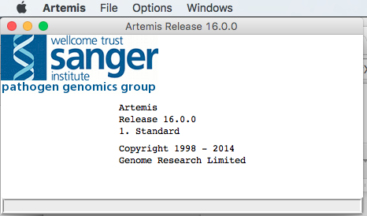
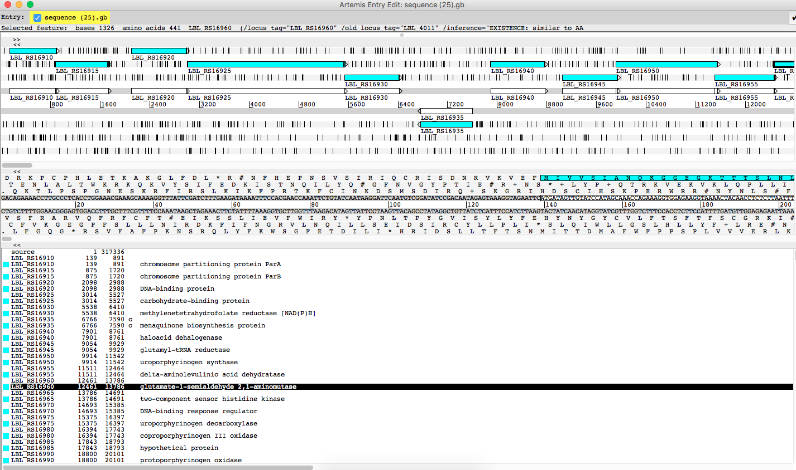

# Getting Started with Artemis

## Background

Artemis is a genome browser and annotation tool. Artemis is written in Java and can be used on Mac, Linux or Windows. While it can be used to view any genomic data, it is specifically designed for viewing bacterial or viral genomes. A variety of file types can be loaded and viewed using Artemis; these include fasta, multifasta, EMBL, GenBank and GFF format files.

## Learning objectives

At the end of this tutorial, you should be able to:

1.  install Artemis on your laptop
2.  download a bacterial genome sequence
3.  open the genome sequence in Artemis and navigate the sequence (?features).

## Install Artemis

- Artemis is available at no cost from the Sanger Institute Website.
- Instructions for downloading and installing Artemis can be found at: <http://www.sanger.ac.uk/science/tools/artemis>
- Download and run.
- Not working? The most common problem: Java is either not installed or too old.
- Artemis needs a recent version of Java v1.6 or higher. Go to java.com and update.
- Still not working? Seek help!

## Download a bacterial genome

- Download the sequence of *Leptospira borgpetersenii* serovar Hardjobovis Chromosome II from the NCBI website in GenBank format.  
- Open URL: <http://www.ncbi.nlm.nih.gov>
- Select the “Taxonomy” database from the list on the left hand side.
- Enter “Leptospira borgpetersenii” in the search box and **Search**

- Click on species name:

&nbsp;

- Click on species name again (at the top of the list):

&nbsp;

- Click on the far right number 1 next to "Genome":

&nbsp;

- Click on "Genome Assembly and Annotation report":

&nbsp;

&nbsp;

- Then, for the first species listed, scroll to the far right of the table, see chromosome 2, and click the link to the annotated assembly number NC_008509.1 (not CP0003):

&nbsp;

- Then, click "Send" and choose "Complete Record", "Destination = File", "Format = GenBank (full)"", "Create File".
- Note the download location (e.g. Downloads folder).

&nbsp;

## Open the GenBank file in Artemis

- Open Artemis

- Menu: **File** → **Open**
- Select file from dialog box → **OPEN**

**Demonstration/Discussion of the Artemis interface**

FIXME: put more here
