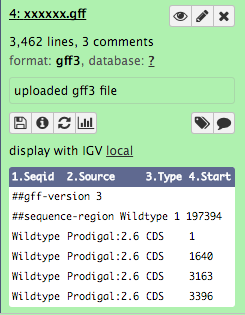
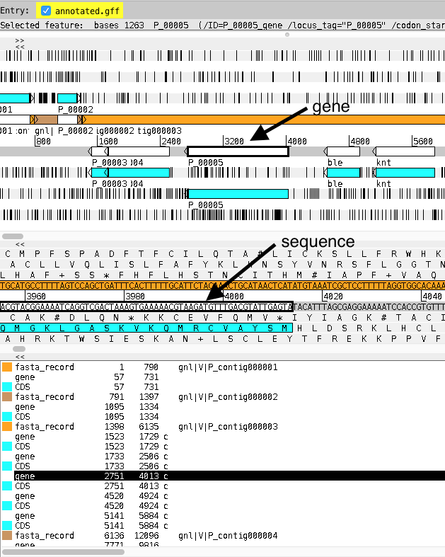

# Genome annotation using Prokka

## Background

In this section we will use a software tool called Prokka to annotate the draft genome sequence produced in Activity 2a. Prokka is a “wrapper”; it collects together several pieces of software (from various authors) - this avoids “re-inventing the wheel”.

Prokka finds and annotates features (both protein coding regions and RNA genes, i.e. tRNA, rRNA) present on on a sequence. Note, Prokka uses a two-step process for the annotation of protein coding regions: first, protein coding regions on the genome are identified using [Prodigal](http://prodigal.ornl.gov/); second, the *function* of the encoded protein is predicted by similarity to proteins in one of many protein or protein domain databases. Prokka is a software tool that can be used to annotate bacterial, archaeal and viral genomes quickly, generating standard output files in GenBank, EMBL and gff formats. More information about Prokka can be found [here](https://github.com/tseemann/prokka).

## Learning objectives

At the end of this tutorial you should be able to :

1. input files into Prokka
2. change settings
3. run Prokka, and
4. examine the output: annotated genome.

## Input data

- You will need the assembled contigs from the previous workshop (Assembly with Spades): <fn>SPAdes_contigs.fasta</fn>
- If you are continuing on from that tutorial, this file will be in your current history and there is no need to find/import it.

## Run Prokka

- In Galaxy, go to <ss>Tools &rarr; NGS Analysis &rarr; NGS: Annotation &rarr; Prokka</ss>  
- Set the following parameters (leave everything else unchanged):
    - <ss>Contigs to annotate</ss>: <fn>SPAdes contigs (fasta)</fn>  
    - <ss>Locus tag prefix (--locustag)</ss>: P
    - <ss>Force GenBank/ENA/DDJB compliance (--compliant)</ss>: *Yes*
    - <ss>Sequencing Centre ID (--centre)</ss>: V
    - <ss>Genus Name</ss>: *Staphylococcus*  
    - <ss>Species Name</ss>: *aureus*  
    - <ss>Use genus-specific BLAST database</ss> *No*  
    - Click <ss>Execute</ss>  

## Examine the output

Once Prokka has finished, examine each of its output files.

- The gff and gbk files contains all of the information about all of the features annotated (in different formats.)
- The txt file contains a summary of the number of features annotated.
- The faa file contains the protein sequences of the genes annotated.
- The ffn file contains the nucleotide sequences of the genes annotated.

- Download the gff file to your local computer: click on the file name with the .gff extension, and then click on the disk icon .

## Annotated features
Now that we have annotated the draft genome sequence, we would like to view the sequence in the Artemis genome viewer.

- Open Artemis and load the downloaded .gff file.
- The top panel shows an overview - here we can see annotated genes and other features.
- The middle panel shows the DNA sequence and amino acid translations in 6 frames.
- The bottom panel shows a text summary of the features.
- Scroll left and right with the horizontal bars under each panel.
- Zoom with the vertical bars to the right.

